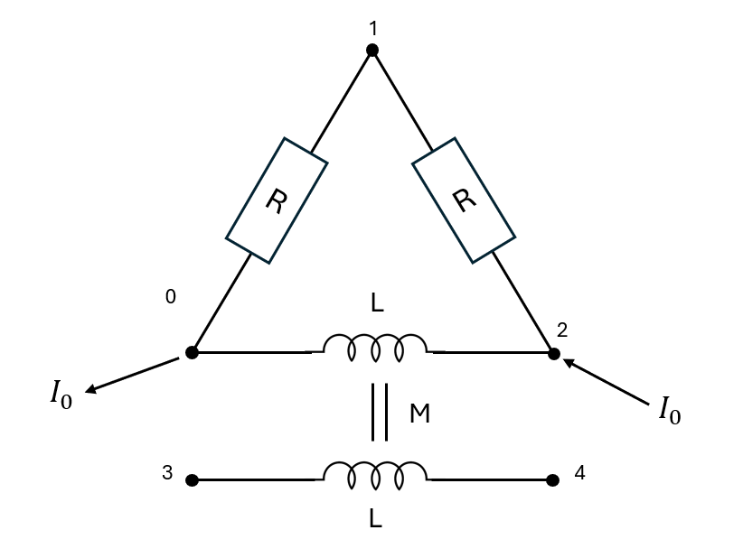
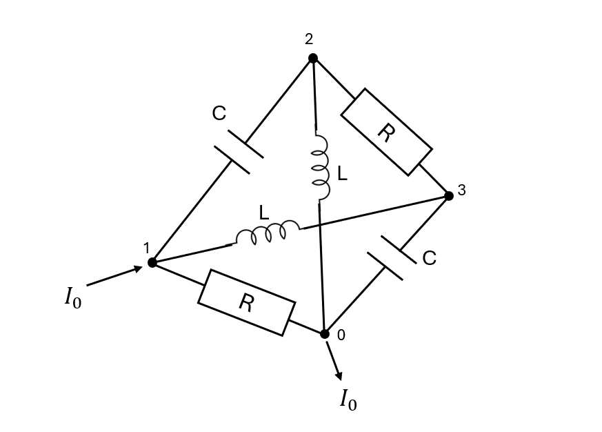
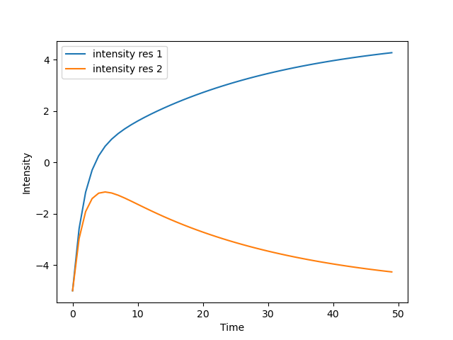

# ElectricSystemSolver

## Overview

**ElectricSystemSolver** formalizes electric systems as linear problems, suitable for both **temporal** and **frequency-domain** studies.
It focuses on constructing the linear system representation, leaving the actual numerical solution to the user.

This repository is **not** a general-purpose electrical system solver. Instead, it acts as a **bridge** between:

- The graph-based description of an electric network
- The corresponding sparse linear system to solve

## Table of content

- [ElectricSystemSolver](#electricsystemsolver)
  - [Overview](#overview)
  - [Table of content](#table-of-content)
  - [How to install](#how-to-install)
  - [Components](#components)
    - [FrequencySystemBuilder](#frequencysystembuilder)
      - [Features](#features)
      - [Example](#example)
      - [Adding a Parallel Resistance](#adding-a-parallel-resistance)
    - [TemporalSystemBuilder](#temporalsystembuilder)
      - [Supported Elements](#supported-elements)
      - [Example](#example-1)
  - [Solver suggestions](#solver-suggestions)

## How to install
For now this package is not distributed the only way to install it is by:

1. Cloning this repo:

```
git clone https://github.com/williampiat3/ElectricSystemSolver.git
```

2. Creating a conda environement using the `env.yml` file:

```
conda env create -n ElecSolver -f ElectricSystemSolver/env.yml
```

> [!WARNING]
> pyMumps is not supported on Windows (But it is on WSL!!): If you want to execute this code on Windows, remove pyMumps from the `env.yml` file and use other solvers instead

3. Exporting the `PYTHONPATH` variable to import the system builders more smoothly

```
export PYTHONPATH='path/to/ElectricSystemSolver/src/ElecSolver'
```


## Components

### FrequencySystemBuilder

This class handles **frequency-domain** analysis of linear electric systems.

#### Features

- Supports tension and intensity sources
- Models inductive and resistive mutuals
- Detects and couples multiple subsystems
- Accepts arbitrary complex impedances and mutuals
- Constructs sparse linear systems (COO format)


> [!TIP]
> Some solvers do not support complex-valued systems. Use the utility function `cast_complex_system_in_real_system` in `utils.py` to convert an `n`-dimensional complex system into a `2n`-dimensional real system.

#### Example

We would like to study the following system:


this can simply be defined in the following manner (We took R=1, L=1 and M=2):
```python
import numpy as np
from scipy.sparse.linalg import spsolve
from FrequencySystemBuilder import FrequencySystemBuilder


# Complex and sparse impedance matrix
# notice coil impedence between points 0 and 2, and coil impedence between 3 and 4
impedence_coords = np.array([[0,0,1,3],[1,2,2,4]], dtype=int)
impedence_data = np.array([1, 1j, 1, 1j], dtype=complex)

# Mutual inductance or coupling
# The indexes here are the impedence indexes in impedence_data
# The coupling is inductive
mutuals_coords = np.array([[1],[3]], dtype=int)
mutuals_data = np.array([2.j], dtype=complex)

electric_sys = FrequencySystemBuilder(
    impedence_coords,
    impedence_data,
    mutuals_coords,
    mutuals_data
)

# Set node masses
# 2 values because 2 subsystems
electric_sys.set_mass(0, 3)
# Building system
electric_sys.build_system()
electric_sys.build_second_member_intensity(intensity=10, input_node=2, output_node=0)

# Get and solve the system
sys, b = electric_sys.get_system()
sol = spsolve(sys.tocsr(), b)
intensities, potentials = electric_sys.build_intensity_and_voltage_from_vector(sol)

## We see a tension appearing on the lonely coil (between node 3 and 4)
print(potentials[3]-potentials[4])
```
#### Adding a Parallel Resistance
We want to add components in parallel with existing components for instance inserting a resistor in parallel with the first inductance (between nodes 0 and 2)


In python, simply add the resistance to the list of impedence in the very first lines of the script:

```python
import numpy as np
from scipy.sparse.linalg import spsolve
from FrequencySystemBuilder import FrequencySystemBuilder


# We add an additionnal resistance between 0 and 2
impedence_coords = np.array([[0,0,1,3,0],[1,2,2,4,2]], dtype=int)
impedence_data = np.array([1, 1j,1, 1j,1], dtype=complex)

# No need to change the couplings since indexes of the coils did not change
mutuals_coords = np.array([[1],[3]], dtype=int)
mutuals_data = np.array([2.j], dtype=complex)

```


### TemporalSystemBuilder

This class models **time-dependent** systems using resistors, capacitors, coils, and mutuals.

#### Supported Elements

- Tension and intensity sources
- Resistors, capacitors, inductors
- Inductive and resistive mutuals
- Auto-detection of coupled subsystems

#### Example


We would like to study the following system:


with R=1, L=0.1, C=2 this gives:

```python
import numpy as np
from scipy.sparse.linalg import spsolve
from TemporalSystemBuilder import TemporalSystemBuilder

## Defining resistances
res_coords  = np.array([[0,2],[1,3]],dtype=int)
res_data = np.array([1,1],dtype=float)
## Defining coils
coil_coords  = np.array([[1,0],[3,2]],dtype=int)
coil_data = np.array([0.1,0.1],dtype=float)
## Defining capacities
capa_coords = np.array([[1,3],[2,0]],dtype=int)
capa_data = np.array([2,2],dtype=float)

## Defining empty mutuals here
mutuals_coords=np.array([[],[]],dtype=int)
mutuals_data = np.array([],dtype=float)


res_mutuals_coords=np.array([[],[]],dtype=int)
res_mutuals_data = np.array([],dtype=float)

## initializing system
elec_sys = TemporalSystemBuilder(coil_coords,coil_data,res_coords,res_data,capa_coords,capa_data,mutuals_coords,mutuals_data,res_mutuals_coords,res_mutuals_data)
## Seting mass at point 0
elec_sys.set_mass(0)
## Build second member
elec_sys.build_system()
elec_sys.build_second_member_intensity(10,1,0)
# getting initial condition system
S_i,b = elec_sys.get_init_system()
# initial condition
sol = spsolve(S_i.tocsr(),b)
# get system (S1 is real part, S2 derivative part)
S1,S2,rhs = elec_sys.get_system()

## Solving using euler implicit scheme
dt=0.08
vals_res1 = []
vals_res2 = []
for i in range(50):
    currents_coil,currents_res,currents_capa,voltages,_ = elec_sys.build_intensity_and_voltage_from_vector(sol)
    vals_res1.append(currents_res[1])
    vals_res2.append(currents_res[0])
    sol = spsolve(S2+dt*S1,b*dt+S2@sol)
import matplotlib.pyplot as plt
plt.xlabel("Time")
plt.ylabel("Intensity")
plt.plot(vals_res1,label="intensity res 1")
plt.plot(vals_res2,label="intensity res 2")
plt.legend()
plt.savefig("intensities_res.png")
```

This outputs the following graph that displays the intensity passing through the resistances



## Solver suggestions

- For **small or moderately sized systems**, the built-in `scipy.sparse.linalg.spsolve` is effective.
- For **large-scale temporal problems**, consider using **MUMPS** (via `pyMUMPS`).
  MUMPS is more efficient when only the second member (`b`) changes during time-stepping.

See example in the tests:
`tests.test_temporal_system`