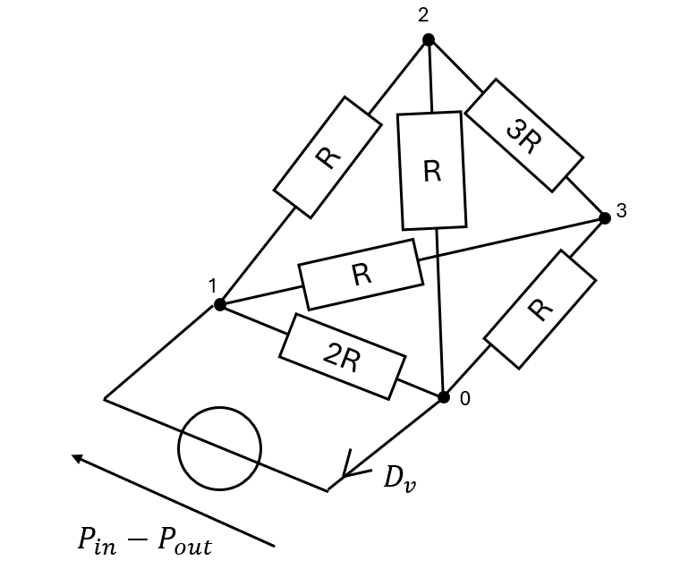

# ElecSolver

## Overview

**ElecSolver** formalizes electric systems as linear problems, suitable for both **temporal** and **frequency-domain** studies.
It focuses on constructing the linear system representation, leaving the actual numerical resolution to the user.

This repository is **not** a general-purpose electrical system solver. Instead, it acts as a **bridge** between:

- The graph-based description of an electric network
- The corresponding sparse linear system to solve


Its main goal is to provide a friendly Python interface for simulating and optimizing analog electric systems. While suitable for small circuit simulations, its strength lies in its scalability: it is able to build linear systems with millions of nodes and components.

Although providing backpropagation of gradients for optimization purposes, ElecSolver is not an auto-differentiation library (and doesn't aim to be). It is rather a tool that can be used in a differentiable programming pipeline. You may use ElecSolver with any auto-differentiation library of your choice (Pytorch, Jax, Tensorflow...) as long as you wrap ElecSolver classes in these frameworks. We aim at keeping ElecSolver as simple as possible with a limited number of dependencies in order to keep it as flexible as possible.


> [!IMPORTANT]
> ElecSolver has been designed with the following specifications in mind:
> - The time needed for building the linear system must be negligible compared to the time needed for solving it.
> - Handle natively inductive mutuals and resistive mutuals
> - Handle as many coupled electric systems that one wants.
> - Deal with lonely nodes and lonely edges in the electric graph: the problem can be well posed and thus solved.
> - Allow backpropagation of gradients through the system for optimization purposes.


> [!NOTE]
> Non-linear components are not supported. You must manage event detection and system updates yourself.


## Table of content

- [ElecSolver](#elecsolver)
  - [Overview](#overview)
  - [Table of content](#table-of-content)
  - [How to install](#how-to-install)
  - [Components](#components)
    - [FrequencySystemBuilder](#frequencysystembuilder)
      - [Features](#features)
      - [Example](#example)
      - [Adding a Parallel Resistance](#adding-a-parallel-resistance)
    - [TemporalSystemBuilder](#temporalsystembuilder)
      - [Features](#features-1)
      - [Example](#example-1)
  - [Solver suggestions](#solver-suggestions)
  - [Extra uses: Hydraulic or Thermal system modeling](#extra-uses-hydraulic-or-thermal-system-modeling)
  - [Netlist import feature](#netlist-import-feature)
  - [Gradient backpropagation](#gradient-backpropagation)
    - [Example of backpropagation of TemporalSystemBuilder](#example-of-backpropagation-of-temporalsystembuilder)
    - [Example of backpropagation of FrequencySystemBuilder](#example-of-backpropagation-of-frequencysystembuilder)


## How to install
For now this package is distributed on pypi and can be installed using pip and conda/mamba
```
pip install ElecSolver
```
or
```
conda install elecsolver
```
For solving the linear systems we advise using MUMPS through `python-mumps` available for linux, macOS and Windows. It can be installed via conda:
```
conda install python-mumps
```


## Components

### FrequencySystemBuilder

This class handles **frequency-domain** analysis of linear electric systems.

#### Features

- Supports tension and intensity sources
- Models inductive and resistive mutuals
- Detects and couples multiple subsystems
- Accepts arbitrary complex impedances and mutuals
- Constructs sparse linear systems (COO format)
- Allows backpropagation of gradients from the linear system to the parameters of the system for optimization purposes


> [!TIP]
> Some solvers do not support complex-valued systems. Use the utility function `cast_complex_system_in_real_system` in `utils.py` to convert an `n`-dimensional complex system into a `2n`-dimensional real system.

#### Example

We would like to study the following system:


this can simply be defined in the following manner (We took R=1, L=1 and M=2):
```python
import numpy as np
from scipy.sparse.linalg import spsolve
from ElecSolver import FrequencySystemBuilder


# Complex and sparse impedance matrix
# notice coil impedence between points 0 and 2, and coil impedence between 3 and 4
impedence_coords = np.array([[0,0,1,3],[1,2,2,4]], dtype=int)
impedence_data = np.array([1, 1j, 1, 1j], dtype=complex)

# Mutual inductance or coupling
# The indexes here are the impedence indexes in impedence_data
# The coupling is inductive
mutuals_coords = np.array([[1],[3]], dtype=int)
mutuals_data = np.array([2.j], dtype=complex)

electric_sys = FrequencySystemBuilder(
    impedence_coords,
    impedence_data,
    mutuals_coords,
    mutuals_data
)

# Add source (Current source here)
electric_sys.add_current_source(intensity=10, input_node=2, output_node=0)
# Set ground
# 2 values because one for each subsystem
electric_sys.set_ground(0, 3)
# Building system
electric_sys.build_system()


# Get and solve the system
sys, b = electric_sys.get_system()
sol = spsolve(sys.tocsr(), b)
frequencial_response = electric_sys.build_intensity_and_voltage_from_vector(sol)

## We see a tension appearing on the lonely coil (between node 3 and 4)
print(frequencial_response.potentials[3]-frequencial_response.potentials[4])
```
#### Adding a Parallel Resistance
We want to add components in parallel with existing components for instance inserting a resistor in parallel with the first inductance (between nodes 0 and 2)


In python, simply add the resistance to the list of impedence in the very first lines of the script:

```python
import numpy as np
from scipy.sparse.linalg import spsolve
from ElecSolver import FrequencySystemBuilder


# We add an additionnal resistance between 0 and 2
impedence_coords = np.array([[0,0,1,3,0],[1,2,2,4,2]], dtype=int)
impedence_data = np.array([1, 1j,1, 1j,1], dtype=complex)

# No need to change the couplings since indexes of the coils did not change
mutuals_coords = np.array([[1],[3]], dtype=int)
mutuals_data = np.array([2.j], dtype=complex)

```


### TemporalSystemBuilder

This class models **time-dependent** systems using resistors, capacitors, coils, and mutuals.

#### Features

- Supports tension and intensity sources
- Models inductive and resistive mutuals
- Detects and couples multiple subsystems
- Accepts 3 dipole types: resistances, capacities and coils
- Constructs sparse linear systems (COO format)
- Allows backpropagation of gradients from the linear systems (plural! gradients from S_init, S1, S2 and rhs!) to the parameters of the system for optimization purposes

#### Example


We would like to study the following system:


with R=1, L=0.1, C=2 this gives:

```python
import numpy as np
from scipy.sparse.linalg import spsolve
from ElecSolver import TemporalSystemBuilder

## Defining resistances
res_coords  = np.array([[0,2],[1,3]],dtype=int)
res_data = np.array([1,1],dtype=float)
## Defining coils
coil_coords  = np.array([[1,0],[3,2]],dtype=int)
coil_data = np.array([0.1,0.1],dtype=float)
## Defining capacities
capa_coords = np.array([[1,3],[2,0]],dtype=int)
capa_data = np.array([2,2],dtype=float)

## Defining empty mutuals here
mutuals_coords=np.array([[],[]],dtype=int)
mutuals_data = np.array([],dtype=float)


res_mutuals_coords=np.array([[],[]],dtype=int)
res_mutuals_data = np.array([],dtype=float)

## initializing system
elec_sys = TemporalSystemBuilder(coil_coords,coil_data,res_coords,res_data,capa_coords,capa_data,mutuals_coords,mutuals_data,res_mutuals_coords,res_mutuals_data)
## Add source
elec_sys.add_current_source(10,1,0)
## Setting ground at point 0
elec_sys.set_ground(0)
## Build second member
elec_sys.build_system()

# getting initial condition system
S_i,b = elec_sys.get_init_system()
# initial condition
sol = spsolve(S_i.tocsr(),b)
# get system (S1 is real part, S2 derivative part)
S1,S2,rhs = elec_sys.get_system()

## Solving using euler implicit scheme
dt=0.08
vals_res1 = []
vals_res2 = []
for i in range(50):
    temporal_response = elec_sys.build_intensity_and_voltage_from_vector(sol)
    vals_res1.append(temporal_response.intensities_res[1])
    vals_res2.append(temporal_response.intensities_res[0])
    ## implicit euler time iterations
    sol = spsolve(S2+dt*S1,b*dt+S2@sol)
import matplotlib.pyplot as plt
plt.xlabel("Time")
plt.ylabel("Intensity")
plt.plot(vals_res1,label="intensity res 1")
plt.plot(vals_res2,label="intensity res 2")
plt.legend()
plt.savefig("intensities_res.png")
```

This outputs the following graph that displays the intensity passing through the resistances


## Solver suggestions

- For **small or moderately sized systems**, the built-in `scipy.sparse.linalg.spsolve` is effective.
- For **large-scale temporal problems**, consider using **MUMPS** (via `python-mumps`).
  MUMPS is more efficient when only the second member (`b`) changes during time-stepping.

> [!TIP]
> See example `tests.test_temporal_system` in the tests on how to use `python-mumps` for solving the resulting system efficiently.


## Extra uses: Hydraulic or Thermal system modeling

This repository can be used as is in order to model the mass flow or thermal flux in respectively Hydraulic networks or Thermal networks where a difference of pressure or a difference of temperature can be assimilated to a tension source. Since electric potentials are always computed relatively to the ground node you might need to rescale the resulting potentials:

We are considering the following hydraulic problem:



Taking R=1 this gives

```python
import numpy as np
from scipy.sparse.linalg import spsolve
from ElecSolver import TemporalSystemBuilder

## Defining resistances
R = 1
res_coords  = np.array([[0,2,1,0,1,3],[1,3,3,2,2,0]],dtype=int)
res_data = R*np.array([2,3,1,1,1,1],dtype=float)

## Here we are not using coils, capacities or mutuals we defined them as empty
## Defining 0 coil
coil_coords  = np.array([[],[]],dtype=int)
coil_data = np.array([],dtype=float)
## Defining 0 capacity
capa_coords = np.array([[],[]],dtype=int)
capa_data = np.array([],dtype=float)

## Defining no mutual
mutuals_coords=np.array([[],[]],dtype=int)
mutuals_data = np.array([],dtype=float)


res_mutuals_coords=np.array([[],[]],dtype=int)
res_mutuals_data = np.array([],dtype=float)

## initializing system
hydraulic_sys = TemporalSystemBuilder(coil_coords,coil_data,res_coords,res_data,capa_coords,capa_data,mutuals_coords,mutuals_data,res_mutuals_coords,res_mutuals_data)
## Enforcing a pressure delta of 10 Pa
hydraulic_sys.add_voltage_source(10,1,0)
## Setting ground at point 0
hydraulic_sys.set_ground(0)
## Build second member
hydraulic_sys.build_system()

# get system (S1 is real part, S2 derivative part)
# the problem is only resitive thus S2 =0
S1,S2,rhs = hydraulic_sys.get_system()

sol = spsolve(S1.tocsr(),rhs)
solution = hydraulic_sys.build_intensity_and_voltage_from_vector(sol)
# After you computed the solution of the system

pressure_input=10000
pressure_node=0
# Rescaling the potential to the new reference
potentials = solution.potentials - solution.potentials[pressure_node] + pressure_input
print("Pressures in the system:", potentials)
## get the flux passing through the system
print("Debit through the system",solution.intensities_sources[0])
```
## Netlist import feature

A new class, named NetlistParser allows importing passive netlist and building a TemporalSystem instance.
Solving the system can then be performed like any other example above.

```python
"""
*test netlist for python solver square.net
Iin 0 1 PWL(0 0 0.000000001 10)
L0 1 3 0.1
L1 2 0 0.1
R1 1 0 1
R2 2 3 1
c2 1 2 2
c3 0 3 2
.tran 0 4 0 0.08
.end
"""
from scipy.sparse.linalg import spsolve
import matplotlib.pyplot as plt
from ElecSolver import NetlistParser

parser = NetlistParser("square.net")
parser.map_netlist()
node_zero = parser.node_map["0"]
node_one =  parser.node_map["1"]

elec_sys=parser.generate_temporal_system()
# Set 10 A injection entering in node 1 and exiting in node 0
elec_sys.add_current_source(10, node_one, node_zero)
## Setting ground at point 0
elec_sys.set_ground(node_zero)
## Build second member
elec_sys.build_system()
# getting initial condition system
S_i,b = elec_sys.get_init_system()
# initial condition
sol = spsolve(S_i.tocsr(),b)
# get system (S1 is real part, S2 derivative part)
S1,S2,rhs = elec_sys.get_system()

## Solving using euler implicit scheme
dt=0.08
steps = 50
vals_res1 = []
vals_res2 = []
vals_L1 = []
voltage_src = []

R1_index = list(parser.resistors.keys()).index("R1")
R2_index = list(parser.resistors.keys()).index("R2")
L1_index = list(parser.inductors.keys()).index("L1")


for i in range(steps):
    temporal_response = elec_sys.build_intensity_and_voltage_from_vector(sol)
    vals_res1.append(temporal_response.intensities_res[R1_index])
    vals_res2.append(temporal_response.intensities_res[R2_index])
    vals_L1.append(temporal_response.intensities_coil[L1_index])
    voltage_src.append(temporal_response.potentials[node_one]-temporal_response.potentials[node_zero])
    ## implicit euler time iterations
    sol = spsolve(S2+dt*S1,b*dt+S2@sol)


plt.xlabel("Time")
plt.ylabel("Intensity")
plt.plot(arange(steps, dtype=float)*dt, vals_res1, label="intensity res 1")
plt.plot(arange(steps, dtype=float)*dt, vals_res2, label="intensity res 2")
plt.plot(arange(steps, dtype=float)*dt, vals_L1, label="intensity L1")
plt.plot(arange(steps, dtype=float)*dt, voltage_src, label="V(1-0)") # equal to I(R1)

plt.legend()
plt.savefig("intensities_res.png")
```
## Gradient backpropagation
ElecSolver is basically a blackbox that takes as input the parameters of the system (impedences, mutuals, sources) and outputs the linear system to be solved leaving the choice of solver to the user.
In order to allow optimization of the system ElecSolver now gives the possibility to backpropagate gradients from the linear system to the parameters of the system. This allows to use ElecSolver in a optimization loop where one wants to optimize the parameters of the system with gradient descent for instance.

### Example of backpropagation of TemporalSystemBuilder
We want to optimize the capacity values of the system in order to reach a target solution for the first time step.
We can do this by backpropagating the gradients from the solution of the linear system to the capa_data array of the TemporalSystemBuilder instance.
```python
import numpy as np
from scipy.sparse.linalg import spsolve
from ElecSolver import TemporalSystemBuilder
## Simple tetrahedron
res_coords  = np.array([[0,2],[1,3]],dtype=int)
res_data = np.array([1,1],dtype=float)

coil_coords  = np.array([[1,0],[2,3]],dtype=int)
coil_data = np.array([1,1],dtype=float)

capa_coords = np.array([[1,2],[3,0]],dtype=int)
capa_data = np.array([1,1],dtype=float)
## The target solution we want to reach is the solution of the system when capa_data = np.array([0.1,1],dtype=float)

## total impedance
mutuals_coords=np.array([[],[]],dtype=int)
mutuals_data = np.array([],dtype=float)


res_mutuals_coords=np.array([[],[]],dtype=int)
res_mutuals_data = np.array([],dtype=float)

elec_sys = TemporalSystemBuilder(coil_coords,coil_data,res_coords,res_data,capa_coords,capa_data,mutuals_coords,mutuals_data,res_mutuals_coords,res_mutuals_data)
elec_sys.add_current_source(10,1,0)
elec_sys.set_ground(0)
elec_sys.build_system()
# Getting initial condition system
S_i,rhs = elec_sys.get_init_system(sparse_rhs=True)
S1,S2,rhs = elec_sys.get_system(sparse_rhs=True)
sol_init =spsolve(S_i.tocsr(),rhs.todense())
## Time iteration with euler implicit scheme for 1 timestep
dt=0.8
B = rhs*dt+S2@sol_init
A = S2+dt*S1
sol = spsolve(A,B)
## Solution when capa_data = np.array([0.1,1],dtype=float) for first timestep
sol_target = [ 3.24786325, -1.1965812,  -6.16809117,  0.61253561,  0.58404558, -2.63532764, 0., 6.16809117,  2.10826211,  1.4957265 ]
for i in range(1000):

    ## computing gradients
    dB = 2*spsolve(A.T, sol - sol_target)
    ## chain rule for gradients of capa_data (S2 appears twice in the computation graph)
    dS2 = -( dB[S2.row]*sol[S2.col])+(dB[S2.row]*sol_init[S2.col])

    ## Backpropagate gradients from dS2 to capa_data
    gradients = elec_sys.backpropagate_gradients(dS2=dS2)

    ## change the values of capa_data using gradient descent
    elec_sys.capa_data = elec_sys.capa_data - 0.01*gradients.capa_data
    ## After the update of capa_data we need to rebuild the system to update S1, S2 and rhs
    elec_sys.build_system()
    S1,S2,rhs = elec_sys.get_system(sparse_rhs=True)
    ## recomputing solution with euler implicit scheme for 1 timestep
    B = rhs*dt+S2@sol_init
    A = S2+dt*S1
    sol = spsolve(A,B)
## Checking whether we converged to the right solution
np.testing.assert_allclose(elec_sys.capa_data, np.array([0.1,1],dtype=float))
```

The function `backpropagate_gradients` of TemporalSystemBuilder allows to backpropagate gradients from `S_init`, `S1`, `S2` and `rhs`. See tests.test_gradients for more examples of backpropagation of gradients from different systems.

### Example of backpropagation of FrequencySystemBuilder
We want to optimize the value of a tension source in order to reach a target solution for the frequencial response of the system.
```python
import numpy as np
from scipy.sparse.linalg import spsolve
from ElecSolver import FrequencySystemBuilder

## sparse python res matrix
impedence_coords = np.array([[0,0,1],[1,2,2]],dtype=int)
impedence_data = np.array([1,1,1],dtype=complex)

## mutuals
mutuals_coords=np.array([[0],[1]],dtype=int)
mutuals_data = np.array([2.j],dtype=complex)


electric_sys = FrequencySystemBuilder(impedence_coords,impedence_data,mutuals_coords,mutuals_data)
## target solution is the solution of the system when voltage=5
electric_sys.add_voltage_source(voltage=10,input_node=1,output_node=0)
# setting the ground
electric_sys.set_ground(0)
electric_sys.build_system()

## Need to evaluate the system because it was altered when calling the second member
sys,b = electric_sys.get_system(sparse_rhs=True)
sol = spsolve(sys.tocsr(),b.todense())
## Target solution when voltage_source_data = np.array([5],dtype=complex)
sol_target = np.array([-1.66666667+1.66666667j, -0.83333333+1.66666667j, 0.83333333-1.66666667j, 2.5-3.33333333j, 0.+0.j, 5+0.j, 4.16666667+1.66666667j])
for i in range(3000):
    ## computing gradients
    db = 2*spsolve(sys.tocsr().conj().T, sol - sol_target)
    drhs = db[b.row]
    ## Backpropagate gradients from drhs to voltage_source_data
    gradients = electric_sys.backpropagate_gradients(drhs=drhs)
    ## Performing gradient descent on voltage_source_data
    electric_sys.voltage_source_data = electric_sys.voltage_source_data - 0.01*gradients.voltage_source_data
    ## After the update of voltage_source_data we need to rebuild the system to update sys and b
    electric_sys.build_system()
    sys,b = electric_sys.get_system(sparse_rhs=True)
    sol = spsolve(sys.tocsr(),b.todense())
## Checking whether we converged to the right solution
np.testing.assert_allclose(electric_sys.voltage_source_data, np.array([5],dtype=complex))
```

