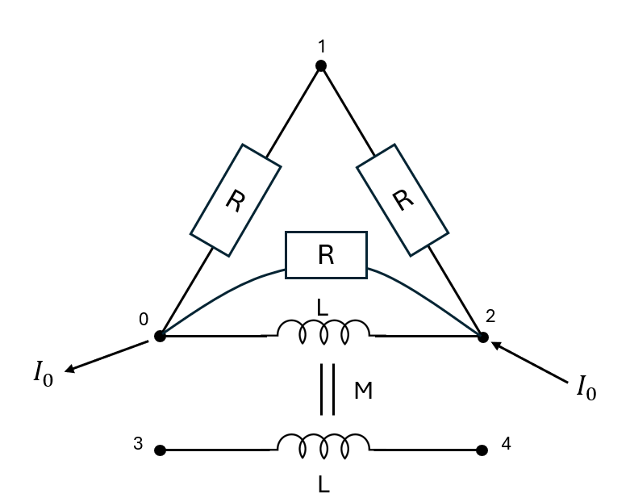

# ElecSolver

## Overview

**ElecSolver** formalizes electric systems as linear problems, suitable for both **temporal** and **frequency-domain** studies.
It focuses on constructing the linear system representation, leaving the actual numerical resolution to the user.

This repository is **not** a general-purpose electrical system solver. Instead, it acts as a **bridge** between:

- The graph-based description of an electric network
- The corresponding sparse linear system to solve

Its main goal is to provide a friendly Python interface for simulating analog electric systems. While suitable for small circuit simulations, its strength lies in scalability—handling millions of nodes and components, provided that you possess sufficient computational resources.


> [!NOTE]
> Non-linear components are not supported. You must manage event detection and system updates yourself.


## Table of content

- [ElecSolver](#elecsolver)
  - [Overview](#overview)
  - [Table of content](#table-of-content)
  - [How to install](#how-to-install)
  - [Components](#components)
    - [FrequencySystemBuilder](#frequencysystembuilder)
      - [Features](#features)
      - [Example](#example)
      - [Adding a Parallel Resistance](#adding-a-parallel-resistance)
    - [TemporalSystemBuilder](#temporalsystembuilder)
      - [Features](#features-1)
      - [Example](#example-1)
  - [Solver suggestions](#solver-suggestions)
  - [Extra uses: Hydraulic or Thermal system modeling](#extra-uses-hydraulic-or-thermal-system-modeling)

## How to install
For now this package is distributed on pypi and can be installed using pip
```
pip install ElecSolver
```
For solving the linear systems we advise using MUMPS through pyMUMPS on linux that can be installed via pip
```
pip install pymumps
```


## Components

### FrequencySystemBuilder

This class handles **frequency-domain** analysis of linear electric systems.

#### Features

- Supports tension and intensity sources
- Models inductive and resistive mutuals
- Detects and couples multiple subsystems
- Accepts arbitrary complex impedances and mutuals
- Constructs sparse linear systems (COO format)


> [!TIP]
> Some solvers do not support complex-valued systems. Use the utility function `cast_complex_system_in_real_system` in `utils.py` to convert an `n`-dimensional complex system into a `2n`-dimensional real system.

#### Example

We would like to study the following system:


this can simply be defined in the following manner (We took R=1, L=1 and M=2):
```python
import numpy as np
from scipy.sparse.linalg import spsolve
from ElecSolver import FrequencySystemBuilder


# Complex and sparse impedance matrix
# notice coil impedence between points 0 and 2, and coil impedence between 3 and 4
impedence_coords = np.array([[0,0,1,3],[1,2,2,4]], dtype=int)
impedence_data = np.array([1, 1j, 1, 1j], dtype=complex)

# Mutual inductance or coupling
# The indexes here are the impedence indexes in impedence_data
# The coupling is inductive
mutuals_coords = np.array([[1],[3]], dtype=int)
mutuals_data = np.array([2.j], dtype=complex)

electric_sys = FrequencySystemBuilder(
    impedence_coords,
    impedence_data,
    mutuals_coords,
    mutuals_data
)

# Set ground
# 2 values because one for each subsystem
electric_sys.set_ground(0, 3)
# Building system
electric_sys.build_system()
electric_sys.build_second_member_intensity(intensity=10, input_node=2, output_node=0)

# Get and solve the system
sys, b = electric_sys.get_system()
sol = spsolve(sys.tocsr(), b)
frequencial_response = electric_sys.build_intensity_and_voltage_from_vector(sol)

## We see a tension appearing on the lonely coil (between node 3 and 4)
print(frequencial_response.potentials[3]-frequencial_response.potentials[4])
```
#### Adding a Parallel Resistance
We want to add components in parallel with existing components for instance inserting a resistor in parallel with the first inductance (between nodes 0 and 2)


In python, simply add the resistance to the list of impedence in the very first lines of the script:

```python
import numpy as np
from scipy.sparse.linalg import spsolve
from ElecSolver import FrequencySystemBuilder


# We add an additionnal resistance between 0 and 2
impedence_coords = np.array([[0,0,1,3,0],[1,2,2,4,2]], dtype=int)
impedence_data = np.array([1, 1j,1, 1j,1], dtype=complex)

# No need to change the couplings since indexes of the coils did not change
mutuals_coords = np.array([[1],[3]], dtype=int)
mutuals_data = np.array([2.j], dtype=complex)

```


### TemporalSystemBuilder

This class models **time-dependent** systems using resistors, capacitors, coils, and mutuals.

#### Features

- Supports tension and intensity sources
- Models inductive and resistive mutuals
- Detects and couples multiple subsystems
- Accepts 3 dipole types: resistances, capacities and coils
- Constructs sparse linear systems (COO format)

#### Example


We would like to study the following system:


with R=1, L=0.1, C=2 this gives:

```python
import numpy as np
from scipy.sparse.linalg import spsolve
from ElecSolver import TemporalSystemBuilder

## Defining resistances
res_coords  = np.array([[0,2],[1,3]],dtype=int)
res_data = np.array([1,1],dtype=float)
## Defining coils
coil_coords  = np.array([[1,0],[3,2]],dtype=int)
coil_data = np.array([0.1,0.1],dtype=float)
## Defining capacities
capa_coords = np.array([[1,3],[2,0]],dtype=int)
capa_data = np.array([2,2],dtype=float)

## Defining empty mutuals here
mutuals_coords=np.array([[],[]],dtype=int)
mutuals_data = np.array([],dtype=float)


res_mutuals_coords=np.array([[],[]],dtype=int)
res_mutuals_data = np.array([],dtype=float)

## initializing system
elec_sys = TemporalSystemBuilder(coil_coords,coil_data,res_coords,res_data,capa_coords,capa_data,mutuals_coords,mutuals_data,res_mutuals_coords,res_mutuals_data)
## Seting ground at point 0
elec_sys.set_ground(0)
## Build second member
elec_sys.build_system()
elec_sys.build_second_member_intensity(10,1,0)
# getting initial condition system
S_i,b = elec_sys.get_init_system()
# initial condition
sol = spsolve(S_i.tocsr(),b)
# get system (S1 is real part, S2 derivative part)
S1,S2,rhs = elec_sys.get_system()

## Solving using euler implicit scheme
dt=0.08
vals_res1 = []
vals_res2 = []
for i in range(50):
    temporal_response = elec_sys.build_intensity_and_voltage_from_vector(sol)
    vals_res1.append(temporal_response.intensities_res[1])
    vals_res2.append(temporal_response.intensities_res[0])
    ## implicit euler time iterations
    sol = spsolve(S2+dt*S1,b*dt+S2@sol)
import matplotlib.pyplot as plt
plt.xlabel("Time")
plt.ylabel("Intensity")
plt.plot(vals_res1,label="intensity res 1")
plt.plot(vals_res2,label="intensity res 2")
plt.legend()
plt.savefig("intensities_res.png")
```

This outputs the following graph that displays the intensity passing through the resistances


## Solver suggestions

- For **small or moderately sized systems**, the built-in `scipy.sparse.linalg.spsolve` is effective.
- For **large-scale temporal problems**, consider using **MUMPS** (via `pyMUMPS`).
  MUMPS is more efficient when only the second member (`b`) changes during time-stepping.

> [!TIP]
> See example `tests.test_temporal_system` in the tests on how to use pyMUMPS for solving the resulting system efficiently.


## Extra uses: Hydraulic or Thermal system modeling

This repository can be used as is in order to model the mass flow or thermal flux in respectively Hydraulic networks or Thermal networks where a difference of pressure or a difference of temperature can be assimilated to a tension source. Since electric potentials are always computed relatively to the ground node you might need to rescale the resulting potentials:

We are considering the following hydraulic problem:


Taking R=1 this gives

```python
import numpy as np
from scipy.sparse.linalg import spsolve
from ElecSolver import TemporalSystemBuilder

## Defining resistances
R = 1
res_coords  = np.array([[0,2,1,0,1,3],[1,3,3,2,2,0]],dtype=int)
res_data = R*np.array([2,3,1,1,1,1],dtype=float)

## Here we are not using coils, capacities or mutuals we defined them as empty
## Defining 0 coil
coil_coords  = np.array([[],[]],dtype=int)
coil_data = np.array([],dtype=float)
## Defining 0 capacity
capa_coords = np.array([[],[]],dtype=int)
capa_data = np.array([],dtype=float)

## Defining no mutual
mutuals_coords=np.array([[],[]],dtype=int)
mutuals_data = np.array([],dtype=float)


res_mutuals_coords=np.array([[],[]],dtype=int)
res_mutuals_data = np.array([],dtype=float)

## initializing system
hydraulic_sys = TemporalSystemBuilder(coil_coords,coil_data,res_coords,res_data,capa_coords,capa_data,mutuals_coords,mutuals_data,res_mutuals_coords,res_mutuals_data)
## Seting ground at point 0
hydraulic_sys.set_ground(0)
## Build second member
hydraulic_sys.build_system()
## enforcing a pressure delta of 10 Pa
hydraulic_sys.build_second_member_tension(10,1,0)
# get system (S1 is real part, S2 derivative part)
# the problem is only resitive thus S2 =0
S1,S2,rhs = hydraulic_sys.get_system()

sol = spsolve(S1.tocsr(),rhs)
solution = hydraulic_sys.build_intensity_and_voltage_from_vector(sol)
# After you computed the solution of the system

pressure_input=10000
pressure_node=0
# Rescaling the potential to the new reference
potentials = solution.potentials - solution.potentials[pressure_node] + pressure_input
print("Pressures in the system:", potentials)
## get the flux passing through the system
print("Debit through the system",solution.intensities_sources[0])
```