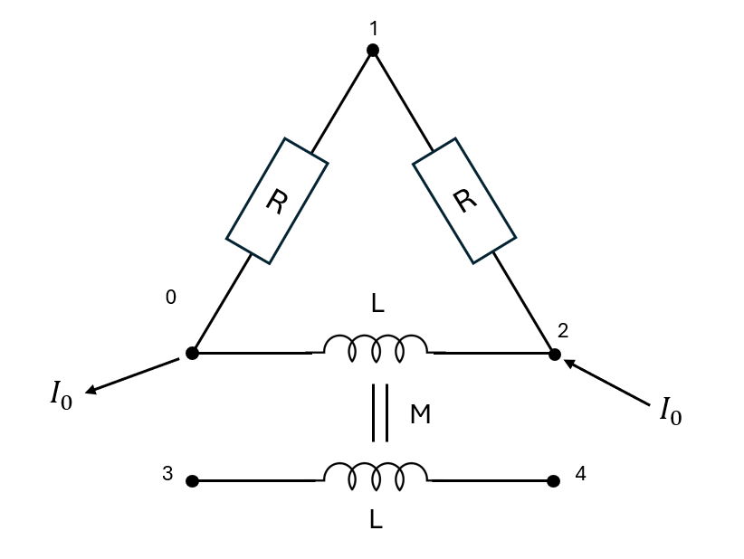
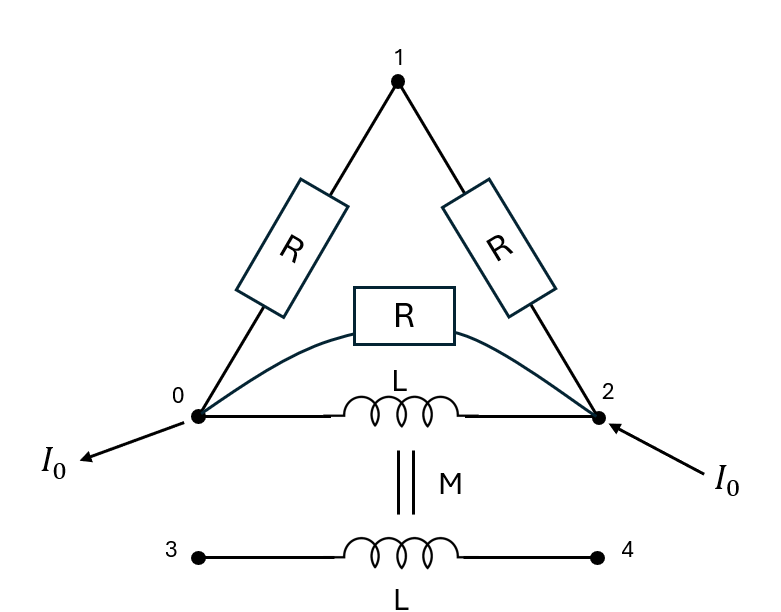

# FrequencySystemBuilder

This class handles **frequency-domain** analysis of linear electric systems.

## Features

- Supports tension and intensity sources
- Models inductive and resistive mutuals
- Detects and couples multiple subsystems
- Accepts arbitrary complex impedances and mutuals
- Constructs sparse linear systems in COO format

!!! tip

    Some solvers do not support complex-valued systems. Use `cast_complex_system_in_real_system` from `utils.py` to convert an `n`-dimensional complex system into a `2n`-dimensional real system.

## Example

We would like to study the following system:



This can be defined in the following manner. We took `R=1`, `L=1` and `M=2`.

``` py
import numpy as np
from scipy.sparse.linalg import spsolve
from ElecSolver import FrequencySystemBuilder


# Complex and sparse impedance matrix
# notice coil impedence between points 0 and 2, and coil impedence between 3 and 4
impedence_coords = np.array([[0, 0, 1, 3], [1, 2, 2, 4]], dtype=int)
impedence_data = np.array([1, 1j, 1, 1j], dtype=complex)

# Mutual inductance or coupling
# The indexes here are the impedence indexes in impedence_data
# The coupling is inductive
mutuals_coords = np.array([[1], [3]], dtype=int)
mutuals_data = np.array([2.0j], dtype=complex)

electric_sys = FrequencySystemBuilder(
    impedence_coords,
    impedence_data,
    mutuals_coords,
    mutuals_data,
)

# Add source (current source here)
electric_sys.add_current_source(intensity=10, input_node=2, output_node=0)

# Set ground
# 2 values because one for each subsystem
electric_sys.set_ground(0, 3)

# Build system
electric_sys.build_system()

# Get and solve the system
sys, b = electric_sys.get_system()
sol = spsolve(sys.tocsr(), b)
frequencial_response = electric_sys.build_intensity_and_voltage_from_vector(sol)

# We see a tension appearing on the lonely coil (between node 3 and 4)
print(frequencial_response.potentials[3] - frequencial_response.potentials[4])
```

## Adding a Parallel Resistance

We want to add components in parallel with existing components, for instance inserting a resistor in parallel with the first inductance between nodes 0 and 2.



In Python, simply add the resistance to the list of impedances in the first lines of the script:

``` py
import numpy as np
from scipy.sparse.linalg import spsolve
from ElecSolver import FrequencySystemBuilder


# We add an additional resistance between 0 and 2
impedence_coords = np.array([[0, 0, 1, 3, 0], [1, 2, 2, 4, 2]], dtype=int)
impedence_data = np.array([1, 1j, 1, 1j, 1], dtype=complex)

# No need to change the couplings since indexes of the coils did not change
mutuals_coords = np.array([[1], [3]], dtype=int)
mutuals_data = np.array([2.0j], dtype=complex)
```

## Gradient Backpropagation

`FrequencySystemBuilder` can backpropagate gradients from `S` and `rhs` to model parameters.

This enables gradient-based optimization loops directly on source values or component data.

### Example: Optimize a Voltage Source

In this example, we optimize the voltage source value so the system response matches a target solution.

``` py
import numpy as np
from scipy.sparse.linalg import spsolve
from ElecSolver import FrequencySystemBuilder

## sparse python res matrix
impedence_coords = np.array([[0, 0, 1], [1, 2, 2]], dtype=int)
impedence_data = np.array([1, 1, 1], dtype=complex)

## mutuals
mutuals_coords = np.array([[0], [1]], dtype=int)
mutuals_data = np.array([2.0j], dtype=complex)

electric_sys = FrequencySystemBuilder(
    impedence_coords,
    impedence_data,
    mutuals_coords,
    mutuals_data,
)

# Target solution is the solution of the system when voltage=5
electric_sys.add_voltage_source(voltage=10, input_node=1, output_node=0)
electric_sys.set_ground(0)
electric_sys.build_system()

## Getting system
sys, b = electric_sys.get_system(sparse_rhs=True)
sol = spsolve(sys.tocsr(), b.todense())

# Target solution (artificially made by setting voltage_source_data = np.array([5], dtype=complex))
sol_target = np.array([
    -1.66666667 + 1.66666667j,
    -0.83333333 + 1.66666667j,
    0.83333333 - 1.66666667j,
    2.5 - 3.33333333j,
    0.0 + 0.0j,
    5.0 + 0.0j,
    4.16666667 + 1.66666667j,
])

for _ in range(3000):
    ## Computing gradients of squared error with respect to b
    db = 2 * spsolve(sys.tocsr().conj().T, sol - sol_target)
    drhs = db[b.row]

    ## Backpropagate gradients from drhs to voltage_source_data
    gradients = electric_sys.backpropagate_gradients(drhs=drhs)
    ## Performing gradient descent on voltage_source_data
    electric_sys.voltage_source_data = (
        electric_sys.voltage_source_data - 0.01 * gradients.voltage_source_data
    )

    ## After updating voltage_source_data, rebuild the system to update sys and b
    electric_sys.build_system()
    sys, b = electric_sys.get_system(sparse_rhs=True)
    sol = spsolve(sys.tocsr(), b.todense())

## Checking whether we converged to the right solution
np.testing.assert_allclose(electric_sys.voltage_source_data, np.array([5], dtype=complex))
```

For additional backpropagation examples, see `tests/test_gradients.py`.

!!! note

    Although providing the backpropagation feature, ElecSolver does not provide an automatic differentiation mechanism. You may use and wrap Elecsolver in automatic differentiation libraries, such as `autograd`, `jax`, `PyTorch` and many more, to avoid the hassle of computing gradients manually.
