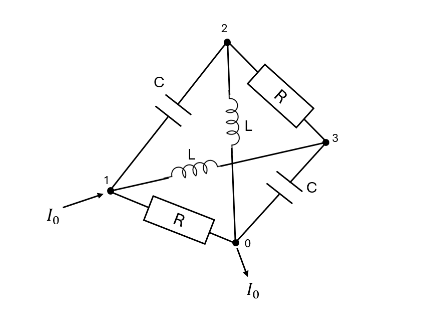
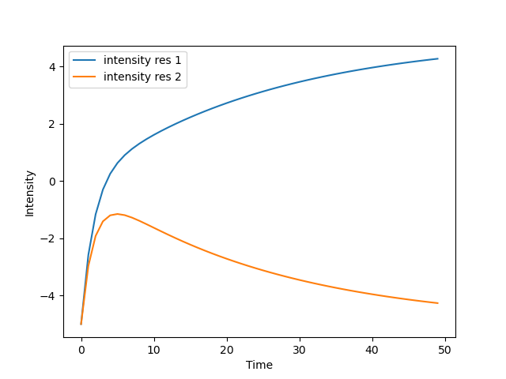

# TemporalSystemBuilder

This class models **time-dependent** systems using resistors, capacitors, coils, and mutuals.

## Features

- Supports tension and intensity sources
- Models inductive and resistive mutuals
- Detects and couples multiple subsystems
- Accepts resistances, capacities, and coils
- Constructs sparse linear systems in COO format

## Example

We would like to study the following system:



With `R=1`, `L=0.1`, `C=2` this gives:

```python
import matplotlib.pyplot as plt
import numpy as np
from scipy.sparse.linalg import spsolve
from ElecSolver import TemporalSystemBuilder

## Defining resistances
res_coords = np.array([[0, 2], [1, 3]], dtype=int)
res_data = np.array([1, 1], dtype=float)

## Defining coils
coil_coords = np.array([[1, 0], [3, 2]], dtype=int)
coil_data = np.array([0.1, 0.1], dtype=float)

## Defining capacities
capa_coords = np.array([[1, 3], [2, 0]], dtype=int)
capa_data = np.array([2, 2], dtype=float)

## Defining empty mutuals here
mutuals_coords = np.array([[], []], dtype=int)
mutuals_data = np.array([], dtype=float)

res_mutuals_coords = np.array([[], []], dtype=int)
res_mutuals_data = np.array([], dtype=float)

## Initializing system
elec_sys = TemporalSystemBuilder(
    coil_coords,
    coil_data,
    res_coords,
    res_data,
    capa_coords,
    capa_data,
    mutuals_coords,
    mutuals_data,
    res_mutuals_coords,
    res_mutuals_data,
)

## Add source
elec_sys.add_current_source(10, 1, 0)

## Setting ground at point 0
elec_sys.set_ground(0)

## Build system
elec_sys.build_system()

# Getting initial condition system
S_i, b = elec_sys.get_init_system()
sol = spsolve(S_i.tocsr(), b)

# Get system (S1 is real part, S2 derivative part)
S1, S2, rhs = elec_sys.get_system()

## Solving using implicit Euler scheme
dt = 0.08
vals_res1 = []
vals_res2 = []

for _ in range(50):
    temporal_response = elec_sys.build_intensity_and_voltage_from_vector(sol)
    vals_res1.append(temporal_response.intensities_res[1])
    vals_res2.append(temporal_response.intensities_res[0])
    sol = spsolve(S2 + dt * S1, b * dt + S2 @ sol)

plt.xlabel("Time")
plt.ylabel("Intensity")
plt.plot(vals_res1, label="intensity res 1")
plt.plot(vals_res2, label="intensity res 2")
plt.legend()
plt.savefig("intensities_res.png")
```

This outputs the following graph that displays the intensity passing through the resistances:



## Gradient Backpropagation

`TemporalSystemBuilder` can backpropagate gradients from `S_init`, `S1`, `S2`, and `rhs` to component parameters.

This makes it possible to optimize circuit parameters with gradient descent in loops where the solver output is compared to a target.

### Example: Optimize Capacitor Values

In this example, we optimize `capa_data` so the solution at `t=0.8` matches a target response.

```python
import numpy as np
from scipy.sparse.linalg import spsolve
from ElecSolver import TemporalSystemBuilder

## Simple tetrahedron
res_coords = np.array([[0, 2], [1, 3]], dtype=int)
res_data = np.array([1, 1], dtype=float)

coil_coords = np.array([[1, 0], [2, 3]], dtype=int)
coil_data = np.array([1, 1], dtype=float)

capa_coords = np.array([[1, 2], [3, 0]], dtype=int)
capa_data = np.array([1, 1], dtype=float)

## mutuals
mutuals_coords = np.array([[], []], dtype=int)
mutuals_data = np.array([], dtype=float)

res_mutuals_coords = np.array([[], []], dtype=int)
res_mutuals_data = np.array([], dtype=float)

elec_sys = TemporalSystemBuilder(
    coil_coords,
    coil_data,
    res_coords,
    res_data,
    capa_coords,
    capa_data,
    mutuals_coords,
    mutuals_data,
    res_mutuals_coords,
    res_mutuals_data,
)
elec_sys.add_current_source(10, 1, 0)
elec_sys.set_ground(0)
elec_sys.build_system()

## Getting initial condition system
S_i, rhs = elec_sys.get_init_system(sparse_rhs=True)
## Getting temporal systems
S1, S2, rhs = elec_sys.get_system(sparse_rhs=True)
## Solving initial condition system
sol_init = spsolve(S_i.tocsr(), rhs.todense())

## Time iteration with euler implicit scheme for 1 timestep
dt = 0.8
B = rhs * dt + S2 @ sol_init
A = S2 + dt * S1
sol = spsolve(A, B)

# Target solution (artificially made by setting capa_data = np.array([0.1, 1], dtype=float))
sol_target = np.array([
    3.24786325,
    -1.1965812,
    -6.16809117,
    0.61253561,
    0.58404558,
    -2.63532764,
    0.0,
    6.16809117,
    2.10826211,
    1.4957265,
])

for _ in range(1000):
    ## computing gradients
    dB = 2 * spsolve(A.T, sol - sol_target)
    ## chain rule for gradients of capa_data (S2 appears twice in the computation graph)
    dS2 = -(dB[S2.row] * sol[S2.col])
    dS2 += dB[S2.row] * sol_init[S2.col]

    ## Backpropagate gradients from dS2 to capa_data
    gradients = elec_sys.backpropagate_gradients(dS2=dS2)
    ## Change the values of capa_data using gradient descent
    elec_sys.capa_data = elec_sys.capa_data - 0.01 * gradients.capa_data

    ## After updating capa_data, rebuild the system to update S1, S2 and rhs
    elec_sys.build_system()
    S1, S2, rhs = elec_sys.get_system(sparse_rhs=True)
    ## Recompute solution with euler implicit scheme
    B = rhs * dt + S2 @ sol_init
    A = S2 + dt * S1
    sol = spsolve(A, B)

## Checking whether we converged to the right solution
np.testing.assert_allclose(elec_sys.capa_data, np.array([0.1, 1], dtype=float))
```

For additional backpropagation examples, see `tests/test_gradients.py`.
